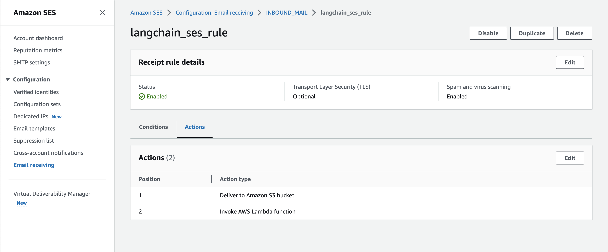

# AI powered Email Customer Support Agent

You will need a verified email address in AWS SES to receive emails. And OpenAI API key to use the API.

Then set the environment variables in the env.ts file.

Then deploy the stack using the following command:
`cdk deploy` 

Optional: run `npx cdk bootstrap` to bootstrap the aws account if you haven't done so.

After the stack is deployed, update email receiving settings for SES, set the recipient condition to your ses verified email and set the actions to save email to S3 bucket and to send email to the lambda function.

## Useful commands

* `npm run build`   compile typescript to js
* `npm run watch`   watch for changes and compile
* `npm run test`    perform the jest unit tests
* `cdk deploy`      deploy this stack to your default AWS account/region
* `cdk diff`        compare deployed stack with current state
* `cdk synth`       emits the synthesized CloudFormation template
